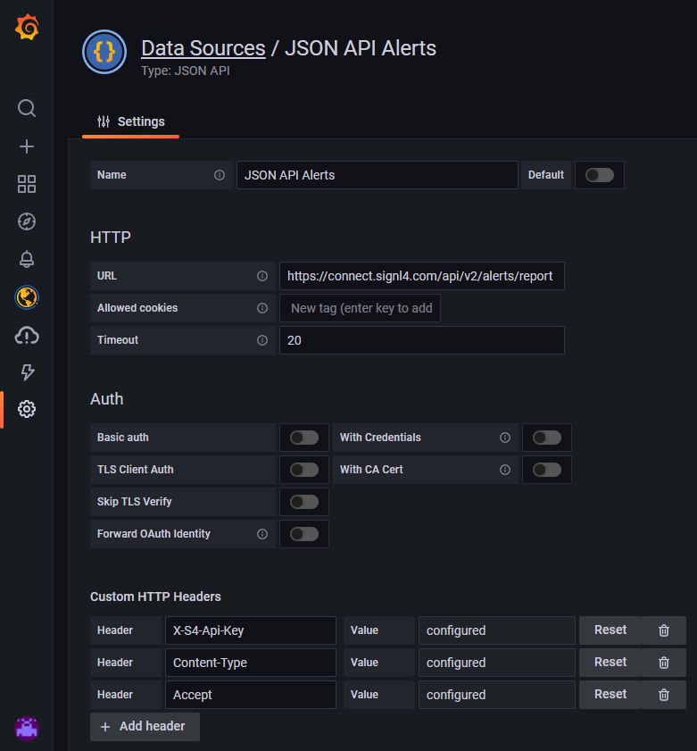

# Duty and alert information in your Grafana dashboard

[Grafana](https://grafana.com/) is as open source analytics and interactive visualization application. You can connect different data sources to display chart and graphs or even [trigger alerts](https://www.signl4.com/de/portfolio_item/grafana-alarmierung-app-sms-voice/).

Wouldn't it be great to add information about SIGNL4 alerts or about who is on call as part of your dashboard? In this case you immediately get an overview about open, acknowledged, and closed alerts per category. Of you can see wo it currently on duty.

Here is an example with a who-is-on call, and an alert overview panel.


In order to display SIGNL4 data in Grafana we use the [SIGNL4 REST API](https://connect.signl4.com/api/docs/index.html?urls.primaryName=SIGNL4%20API%20V2) and the [JSON API plugin](https://grafana.com/grafana/plugins/marcusolsson-json-datasource/) for Grafana.

## How does it work?

First we add the JSON API plugin to Grafana and add new data sources.

For getting the alert overview we use the REST API call to get the alert reports:

```
GET https://connect.signl4.com/api/v2/alerts/report?userId=<user-id>&teamId=<team-id>
X-S4-Api-Key: <signl4-api-key>
```




For getting the on-call information we use the REST API call to get the user information:

```
GET https://connect.signl4.com/api/v2/users
X-S4-Api-Key: <signl4-api-key>
```

Then we add a new panels for the newly created data sources. You can use JSONPath statements to extract the information you need.


For the alert information the configuration looks like this:


That is it and now you can fine tune, add more information or different panels in order to show the respective SIGNL4 information right where you need it.


You can download the sample dashboard [here](SIGNL4-Grafana-Dashboard.json) at GitHub.
